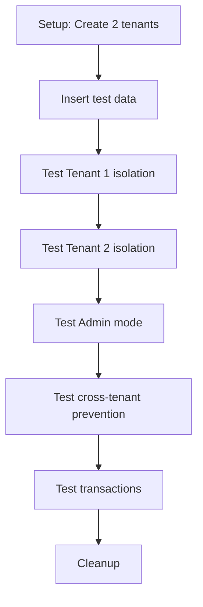

# Tenant Context Integration Tests

Integration tests for Row Level Security (RLS) implementation using the Medusa framework patch.

## Test File

- **`rls-patch.spec.ts`** - Comprehensive tests for RLS patch functionality

## What We Test

### 1. Patch Initialization

- ✅ Verify Knex connection has RLS hooks installed
- ✅ Verify `tenantContextStorage` is available from middleware
- ✅ Verify patch doesn't break normal database operations

### 2. Middleware - Tenant ID Extraction

- ✅ Accept valid UUID in `x-tenant-id` header
- ✅ Reject invalid UUID format
- ✅ Work without tenant_id header (admin mode)

### 3. RLS Data Isolation

- ✅ Tenant 1 sees only their data
- ✅ Tenant 2 sees only their data
- ✅ Admin mode (no tenant) sees all data
- ✅ Cross-tenant access prevention

### 4. Transaction Consistency

- ✅ Maintain tenant context throughout transactions
- ✅ Handle NULL tenant context in transactions

### 5. RLS Policies Verification

- ✅ RLS enabled on tables
- ✅ RLS policies exist
- ✅ `tenant_id` column exists

### 6. Session Variable Management

- ✅ Set and retrieve `app.current_tenant`
- ✅ Handle NULL session variable

## Running Tests

### Run all tenant context tests

```bash
yarn test:integration:api --testPathPattern="tenant-context"
```

### Run specific test file

```bash
yarn test:integration:api --testPathPattern="rls-patch.spec"
```

### Run with verbose output

```bash
yarn test:integration:api:local --testPathPattern="rls-patch.spec"
```

### Run single test

```bash
yarn test:integration:api --testPathPattern="rls-patch.spec" -t "should only return data for tenant 1"
```

## Test Structure

```typescript
describe('RLS Patch - Row Level Security', () => {
  beforeAll(async () => {
    // Setup: Create admin user, sales channel, tenants
  });

  describe('Patch Initialization', () => {
    // Verify patch is installed and working
  });

  describe('Middleware - Tenant ID Extraction', () => {
    // Test x-tenant-id header validation
  });

  describe('RLS Data Isolation', () => {
    beforeAll(async () => {
      // Create test table if needed
      // Enable RLS policies
      // Insert test data for both tenants
    });

    // Test tenant isolation
    // Test cross-tenant prevention
  });

  describe('Transaction Consistency', () => {
    // Test tenant context in transactions
  });

  describe('RLS Policies Verification', () => {
    // Verify RLS is enabled
    // Verify policies exist
  });

  describe('Session Variable Management', () => {
    // Test PostgreSQL session variables
  });
});
```

## Test Data Setup

Tests use the `customer_details` table:

```sql
CREATE TABLE customer_details (
  id UUID PRIMARY KEY DEFAULT gen_random_uuid(),
  tenant_id UUID,
  postal_code VARCHAR(255),
  tax_id VARCHAR(255),
  gender VARCHAR(50),
  created_at TIMESTAMP DEFAULT NOW(),
  updated_at TIMESTAMP DEFAULT NOW()
);

-- Enable RLS
ALTER TABLE customer_details ENABLE ROW LEVEL SECURITY;
ALTER TABLE customer_details FORCE ROW LEVEL SECURITY;

-- Create policies
CREATE POLICY customer_details_tenant_isolation_select ON customer_details
  FOR SELECT
  USING (
    tenant_id = current_setting('app.current_tenant', true)::UUID
    OR current_setting('app.current_tenant', true) IS NULL
  );
```

## Test Flow



## Key Test Cases

### Tenant Isolation Test

```typescript
it('should only return data for tenant 1 when tenant context is set', async () => {
  const knex = appContainer.resolve(ContainerRegistrationKeys.PG_CONNECTION);

  // Set tenant context using AsyncLocalStorage (simulates middleware)
  await tenantContextStorage.run({ tenantId: tenantId1 }, async () => {
    // Query - patch automatically sets app.current_tenant
    const result = await knex.raw(`SELECT id, tenant_id FROM customer_details`);

    // Verify only tenant 1's data is returned
    expect(result.rows.length).toBeGreaterThan(0);
    result.rows.forEach((row) => {
      expect(row.tenant_id).toBe(tenantId1);
    });
  });
});
```

### Cross-Tenant Prevention Test

```typescript
it('should prevent cross-tenant data access', async () => {
  const knex = appContainer.resolve(ContainerRegistrationKeys.PG_CONNECTION);

  // Set tenant 1 context
  await tenantContextStorage.run({ tenantId: tenantId1 }, async () => {
    // Try to access tenant 2's specific record
    const result = await knex.raw(
      `SELECT id FROM customer_details WHERE id = '${tenant2RecordId}'`
    );

    // Should return empty (RLS blocks access)
    expect(result.rows.length).toBe(0);
  });
});
```

### Admin Mode Test

```typescript
it('should return all data when no tenant context is set (admin mode)', async () => {
  const knex = appContainer.resolve(ContainerRegistrationKeys.PG_CONNECTION);

  // No tenant context - admin mode
  const result = await knex.raw(`SELECT id, tenant_id FROM customer_details`);

  // Should see data from both tenants
  const tenantIds = result.rows.map((row) => row.tenant_id);
  expect(tenantIds).toContain(tenantId1);
  expect(tenantIds).toContain(tenantId2);
});
```

### Transaction Test

```typescript
it('should maintain tenant context throughout transaction', async () => {
  const knex = appContainer.resolve(ContainerRegistrationKeys.PG_CONNECTION);

  await tenantContextStorage.run({ tenantId: tenantId1 }, async () => {
    await knex.transaction(async (trx) => {
      // All queries in transaction should use tenant context
      const result = await trx.raw(`SELECT id, tenant_id FROM customer_details`);

      result.rows.forEach((row) => {
        expect(row.tenant_id).toBe(tenantId1);
      });
    });
  });
});
```

## Debugging Failed Tests

### Check if patch is applied

```bash
grep -n "RLS_PATCH" node_modules/@medusajs/framework/dist/database/pg-connection-loader.js
```

Expected output:

```
14:        logger_1.logger.info('[RLS_PATCH] Initializing Row Level Security hooks...');
...
```

### Check server logs

```bash
yarn dev
```

Look for:

```
[RLS_PATCH] Initializing Row Level Security hooks on Knex connection
[RLS_PATCH] Hooked into client.acquireConnection
[RLS_PATCH] Hooked into client.query
[RLS_PATCH] Hooked into transaction
[RLS_PATCH] Row Level Security hooks initialized successfully
```

### Enable debug logging in tests

```typescript
beforeAll(async () => {
  // Enable debug logging
  process.env.LOG_LEVEL = 'debug';
});
```

### Check RLS policies manually

```sql
-- Check if RLS is enabled
SELECT tablename, rowsecurity
FROM pg_tables
WHERE schemaname = 'public' AND tablename = 'customer_details';

-- Check policies
SELECT * FROM pg_policies
WHERE schemaname = 'public' AND tablename = 'customer_details';

-- Test session variable
SET app.current_tenant = 'some-uuid';
SELECT current_setting('app.current_tenant', true);

-- Test RLS filtering
SELECT * FROM customer_details; -- Should be filtered by tenant
```

### Test manually with curl

```bash
# Tenant 1 request
curl -H "x-tenant-id: <tenant-1-uuid>" \
  http://localhost:9000/store/products

# Tenant 2 request
curl -H "x-tenant-id: <tenant-2-uuid>" \
  http://localhost:9000/store/products

# Admin request (no tenant)
curl -H "Authorization: Bearer <admin-token>" \
  http://localhost:9000/admin/products
```

## Common Issues

### Issue: Tests fail with "customer_details does not exist"

**Solution**: Tests automatically create the table if it doesn't exist. Check database permissions.

### Issue: RLS not filtering data

**Possible causes**:

1. Patch not applied - Run `yarn install`
2. RLS policies not created - Check migration ran
3. Tenant context not set - Check middleware logs

**Debug**:

```typescript
// Add logging to see what's happening
const result = await knex.raw(`
  SELECT 
    current_setting('app.current_tenant', true) as tenant,
    * 
  FROM customer_details
`);
console.log('Current tenant:', result.rows[0]?.tenant);
```

### Issue: All tests pass but production doesn't work

**Check**:

1. Middleware registered globally (`src/api/middlewares.ts`)
2. `x-tenant-id` header sent in production requests
3. RLS policies exist on production database
4. Patch applied in production build

## CI/CD Integration

Tests run automatically in GitHub Actions:

```yaml
- name: Run integration tests
  run: yarn test:integration:api --testPathPattern="tenant-context"
```

## Performance Considerations

Tests include performance checks:

- ✅ WeakMap caching prevents redundant `set_config` calls
- ✅ Session-level scope persists tenant context
- ✅ Connection pooling with proper context reset

## Related Documentation

- `patches/README.md` - Framework patch documentation
- `src/modules/tenant-context/README.md` - Module documentation
- `docs/SUMMARY_MULTI_TENANCY_PL.md` - Multi-tenancy guide
- [PostgreSQL RLS Docs](https://www.postgresql.org/docs/current/ddl-rowsecurity.html)
