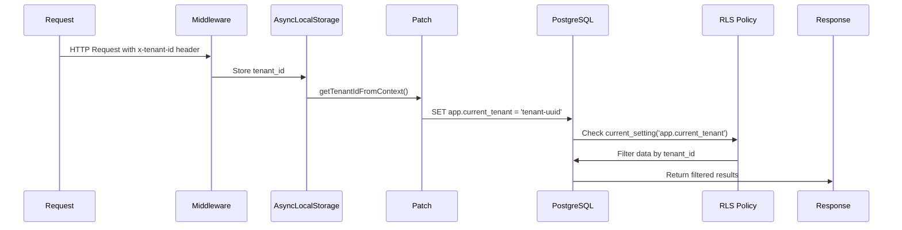

# Medusa Framework Patches - Row Level Security (RLS)

This directory contains patches for the Medusa framework that add Row Level Security support for multi-tenancy.

## Overview

The patch modifies `@medusajs/framework/dist/database/pg-connection-loader.js` to automatically inject tenant context into **all** database queries, ensuring that RLS policies are properly enforced.

## Patch: @medusajs+framework+2.10.1.patch

### What it does

Wraps all Knex database connection hooks to:

1. **Hook into connection acquisition** - Sets tenant context when connections are acquired from pool
2. **Hook into query execution** - Ensures tenant context is set before each query
3. **Hook into transactions** - Maintains tenant context throughout transaction lifecycle
4. **Optimize performance** - Uses WeakMap to avoid redundant `set_config` calls

### How it works



### Integration with your code

The patch integrates with the `tenant-context` module:

```typescript
// src/modules/tenant-context/middleware.ts
export const tenantContextStorage = new AsyncLocalStorage<TenantContext>();
```

The patch reads tenant_id from this AsyncLocalStorage:

```javascript
// In patch: patches/@medusajs+framework+2.10.1.patch
function getTenantIdFromContext() {
  const tenantContextModule = require('src/modules/tenant-context/middleware');
  const store = tenantContextModule?.tenantContextStorage?.getStore();
  return store?.tenantId || null;
}
```

## Architecture

### Files involved

1. **`patches/@medusajs+framework+2.10.1.patch`** - Medusa framework patch (this file)
2. **`src/modules/tenant-context/middleware.ts`** - AsyncLocalStorage for tenant context
3. **`src/modules/tenant-context/index.ts`** - Module registration
4. **`src/api/middlewares.ts`** - Registers `tenantContextMiddleware` globally
5. **`src/modules/tenant-context/migrations/Migration*.ts`** - Creates RLS policies

### Request Flow

```
1. HTTP Request → tenantContextMiddleware (extracts x-tenant-id header)
2. tenantContextMiddleware → AsyncLocalStorage (stores tenant_id)
3. Database Query → Patch hooks (reads from AsyncLocalStorage)
4. Patch → PostgreSQL (SET app.current_tenant = 'uuid')
5. PostgreSQL RLS Policy → Filters data by tenant_id
6. Response → Only tenant's data returned
```

## Why use a patch instead of a custom loader?

### ❌ Old Approach (Custom Loader)

```typescript
// src/modules/tenant-context/loaders/database-connection.ts (DEPRECATED)
export default async function databaseConnectionLoader({ container }) {
  const knex = container.resolve(ContainerRegistrationKeys.PG_CONNECTION);
  // Hook into Knex...
}
```

**Problems:**

- Only hooks connections resolved manually from container
- Runs after modules are initialized (too late)
- Can be bypassed by modules creating connections directly
- Doesn't work with all Medusa modules

### ✅ New Approach (Framework Patch)

```javascript
// patches/@medusajs+framework+2.10.1.patch
async function pgConnectionLoader() {
  const pgConnection = createPgConnection(...);
  // Hook into ALL connections at initialization time
}
```

**Advantages:**

- ✅ Hooks **ALL** database connections (cannot be bypassed)
- ✅ Runs at connection initialization time (before any queries)
- ✅ Works with **all** Medusa modules (including external ones)
- ✅ No dependency on loader execution order

## Usage

### 1. Add tenant_id header to requests

```bash
curl -H "x-tenant-id: 123e4567-e89b-12d3-a456-426614174000" \
  http://localhost:9000/store/products
```

### 2. All queries automatically filtered by tenant

```typescript
// Any code that queries the database
const products = await productService.list();
// → Only returns products for tenant '123e4567-e89b-12d3-a456-426614174000'
```

### 3. Admin mode (no tenant filter)

```bash
# Request without x-tenant-id header
curl http://localhost:9000/admin/products
# → Returns ALL products (RLS policy allows NULL tenant)
```

## Installation

The patch is automatically applied after `yarn install` via the `postinstall` script:

```json
{
  "scripts": {
    "postinstall": "patch-package"
  }
}
```

## Testing

Run the RLS integration tests:

```bash
yarn test:integration:api --testPathPattern="rls.spec"
```

Tests verify:

- ✅ Tenant isolation (each tenant sees only their data)
- ✅ Admin mode (no tenant = see all data)
- ✅ Cross-tenant access prevention
- ✅ Session variable management
- ✅ Transaction consistency

## Logging

The patch adds detailed logging with `[RLS_PATCH]` prefix:

```
[RLS_PATCH] Initializing Row Level Security hooks on Knex connection
[RLS_PATCH] Hooked into client.acquireConnection
[RLS_PATCH] Hooked into client.query
[RLS_PATCH] Hooked into transaction
[RLS_PATCH] Row Level Security hooks initialized successfully
```

Debug logs (LOG_LEVEL=debug):

```
[RLS_PATCH] Set app.current_tenant: 123e4567-e89b-12d3-a456-426614174000 for connection
[RLS_PATCH] Transaction called with tenantId: 123e4567-e89b-12d3-a456-426614174000
```

## Performance Optimizations

1. **WeakMap caching** - Tracks tenant_id per connection to avoid redundant `set_config` calls
2. **Lazy tenant detection** - Only checks AsyncLocalStorage when needed
3. **Session-level scope** - `set_config(..., false)` persists for connection lifetime
4. **Connection pooling** - Reuses connections with proper tenant context reset

## Maintenance

### Updating the patch after Medusa upgrade

1. Check if patch applies cleanly:

   ```bash
   yarn install
   # Look for patch-package warnings
   ```

2. If patch fails, manually merge changes:

   ```bash
   vi node_modules/@medusajs/framework/dist/database/pg-connection-loader.js
   # Add RLS hooks manually
   ```

3. Regenerate patch:

   ```bash
   npx patch-package @medusajs/framework
   ```

4. Test:
   ```bash
   yarn test:integration:api --testPathPattern="rls.spec"
   ```

### Modifying the RLS implementation

1. Edit the file:

   ```bash
   vi node_modules/@medusajs/framework/dist/database/pg-connection-loader.js
   ```

2. Test changes:

   ```bash
   yarn dev
   # Verify logs and functionality
   ```

3. Regenerate patch:

   ```bash
   npx patch-package @medusajs/framework
   ```

4. Commit:
   ```bash
   git add patches/@medusajs+framework+2.10.1.patch
   git commit -m "Update RLS patch: <description>"
   ```

## Troubleshooting

### Patch not applied

**Symptom**: No `[RLS_PATCH]` logs during startup

**Solutions**:

1. Check `package.json` has `"postinstall": "patch-package"`
2. Run `yarn install --force`
3. Verify patch file exists: `ls patches/@medusajs+framework+2.10.1.patch`

### RLS not working

**Symptom**: Queries return data from all tenants

**Debug**:

1. Check logs for `[RLS_PATCH]` initialization
2. Verify middleware exports `tenantContextStorage`:
   ```typescript
   // src/modules/tenant-context/middleware.ts
   export const tenantContextStorage = new AsyncLocalStorage<TenantContext>();
   ```
3. Check RLS policies exist:
   ```sql
   SELECT * FROM pg_policies
   WHERE schemaname = 'public' AND tablename = 'your_table';
   ```
4. Enable debug logging:
   ```bash
   LOG_LEVEL=debug yarn dev
   ```

### Tenant context not set

**Symptom**: `[RLS_PATCH] Set app.current_tenant: null` in logs

**Causes**:

1. Request missing `x-tenant-id` header
2. Middleware not setting context in AsyncLocalStorage
3. Tenant ID format invalid (must be UUID)

**Debug**:

```typescript
// In src/modules/tenant-context/middleware.ts
export function tenantContextMiddleware(req, res, next) {
  const tenantId = req.headers['x-tenant-id'];
  console.log('[TENANT_MIDDLEWARE] tenant_id:', tenantId);
  // ...
}
```

## Related Documentation

- `src/modules/tenant-context/README.md` - Module documentation
- `docs/SUMMARY_MULTI_TENANCY_PL.md` - Multi-tenancy implementation guide
- `integration-tests/api/tenant-context/rls.spec.ts` - RLS tests
- [PostgreSQL RLS Documentation](https://www.postgresql.org/docs/current/ddl-rowsecurity.html)
- [patch-package Documentation](https://github.com/ds300/patch-package)
